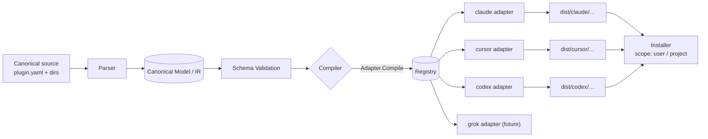

# omniplug — Architecture Design

> **Status:** Draft v0.1 · **Date:** 2026-06-21 · **Owner:** Ashok
> **Project:** `omniplug` · **CLI binary:** `omniplug`
> **Goal:** Author an AI agent plugin **once** in a tool-neutral canonical format, and use a Go CLI to compile and install it into Claude Code, Cursor, and Codex — designed so that adding a new target (Grok, Gemini CLI, etc.) requires **one adapter and zero core changes**.

---

## 1. Problem & Goals

Every AI coding agent (Claude Code, Cursor, Codex, Gemini CLI, Grok, …) exposes the same *conceptual* extension points — reusable skills, external tools via MCP, slash commands/prompts, subagents, and lifecycle hooks — but each wraps them in a different on-disk layout and manifest format. Maintaining N parallel copies of the same plugin does not scale and drifts over time.

**Goals**

1. **Single source of truth.** Author skills, MCP servers, commands, agents, and hooks once.
2. **Compile + install to many targets.** `build` to a dist folder; `install` into the tool's real config location.
3. **Extensible by design.** Adding a target is implementing one interface and registering it. The core compiler never grows a `switch target {…}`.
4. **Standards-first & maintainable.** Versioned schema, JSON-Schema validation, golden-file tests per adapter, semantic versioning, CI.
5. **Graceful degradation.** Targets that don't support a component get a clear warning, not a silent failure.

**Non-goals (v1)**

- Building the MCP servers themselves (we package/reference them, not implement them).
- A GUI or marketplace hosting service.
- Runtime behavior of the agents — only authoring, compiling, and installing plugin assets.

---

## 2. Design Principles

| Principle | Application |
|---|---|
| **Open/Closed** | Core is closed for modification, open for extension via the `Adapter` registry. |
| **Capability negotiation** | Adapters *declare* what they support; the compiler adapts instead of branching. |
| **Lean on emerging standards** | `SKILL.md` is now a cross-tool standard (Claude, Codex, Cursor, Gemini CLI, 30+ tools). Pass it through verbatim; only transform the non-portable wrappers. |
| **Versioned IR** | The canonical manifest carries `apiVersion`; the in-memory model is decoupled from both source files and target outputs. |
| **Deterministic output** | Same input → byte-identical output (golden-file testable). |
| **Fail loud at the edges** | Validate aggressively at parse time; never emit a half-formed target layout. |

---

## 3. Background: how each target works today

Concise survey of the three v1 targets (verified June 2026). This is what the adapters must produce.

### Claude Code (plugin model)
- Manifest: `.claude-plugin/plugin.json` (optional — auto-discovery if omitted).
- Components live at **plugin root** (not inside `.claude-plugin/`): `skills/`, `commands/`, `agents/`, `hooks/`, plus `.mcp.json`.
- Skills are folders with `SKILL.md`; commands are plain markdown files (`/name`).
- Hooks: `hooks/hooks.json`, events are case-sensitive (`PostToolUse`), hook types `command|http|mcp_tool|prompt|agent`.
- Distribution: a **marketplace** = a git repo with `.claude-plugin/marketplace.json` listing plugins; `claude plugin install <name>`.

### Cursor
- Rules: `.cursor/rules/*.mdc` with 4 activation modes (Always, Auto-Attached via globs, Agent-Requested via description, Manual `@rule`). Legacy single `.cursorrules` still read.
- MCP: `.cursor/mcp.json` (project) or `~/.cursor/mcp.json` (global). ~40 active-tool ceiling across servers.
- **Skills:** now supported — discovered from `.cursor/skills/` **and** for compatibility from Claude/Codex skill dirs. Same `SKILL.md` standard.

### Codex
- Guidance: `AGENTS.md` (global `~/.codex/AGENTS.md`; repo-root and nested, closest-wins).
- Skills: `.agents/skills/` (repo) or `$HOME/.agents/skills` (global); `SKILL.md` + `scripts/`, `references/`, `assets/`.
- MCP deps for a skill declared in `agents/openai.yaml`.
- Prompts: `~/.codex/prompts/*.md` (deprecated in favor of skills).
- Plugins are the installable distribution unit; skills are the authoring format.
- Subagents and hooks have first-class config.

### Cross-cutting takeaway
`SKILL.md` and MCP server definitions are **portable**; commands/prompts, hooks, agents, and the manifest wrappers are **target-specific** and are where the compiler earns its keep.

---

## 4. Canonical Source Format

The repository the user authors. Tool-neutral, human-friendly, git-friendly.

```
my-plugin/
├── plugin.yaml                 # manifest — single source of truth
├── skills/                     # portable (cross-tool standard)
│   └── <skill-name>/
│       ├── SKILL.md
│       ├── scripts/
│       └── references/
├── commands/                   # neutral slash-command/prompt defs
│   └── <command>.md            #   markdown body + YAML frontmatter
├── agents/                     # neutral subagent defs
│   └── <agent>.md              #   frontmatter: name, description, model, tools
├── hooks/                      # neutral lifecycle hooks
│   └── hooks.yaml              #   event → action mapping + scripts/
├── mcp/
│   └── servers.yaml            # neutral MCP server definitions
├── guidance/                   # optional shared instructions (→ AGENTS.md etc.)
│   └── AGENTS.md
└── assets/                     # shared static files
```

### `plugin.yaml` (manifest) — proposed schema

```yaml
apiVersion: omniplug/v1             # schema version (forward-compat gate)
name: my-plugin
version: 0.1.0                      # semver of the plugin itself
description: One-line summary used for discovery.
author:
  name: Ashok
  url: https://github.com/<org>/omniplug
license: MIT

# Components are auto-discovered from conventional dirs; this block
# allows custom paths, ordering, and per-target opt-out.
components:
  skills:   { path: skills/,   include: ["*"] }
  commands: { path: commands/, include: ["*"] }
  agents:   { path: agents/,   include: ["*"] }
  hooks:    { path: hooks/hooks.yaml }
  mcp:      { path: mcp/servers.yaml }
  guidance: { path: guidance/AGENTS.md }

# Optional per-target overrides (escape hatch; rarely needed).
targets:
  cursor:
    commands: { mode: manual }      # how to map commands on this target
  codex:
    prompts:  { deprecatedOk: true }
```

`mcp/servers.yaml` (neutral; compiled into each target's MCP format):

```yaml
servers:
  - name: github
    transport: stdio                # stdio | http | sse
    command: npx
    args: ["-y", "@modelcontextprotocol/server-github"]
    env:
      GITHUB_TOKEN: ${GITHUB_TOKEN}
  - name: docs
    transport: http
    url: https://mcp.internal/docs
```

`hooks/hooks.yaml` (neutral; targets that don't support hooks get a warning):

```yaml
hooks:
  - event: PostToolUse              # canonical event name; adapters remap/casing
    matcher: "Edit|Write"
    type: command
    command: ./hooks/scripts/format.sh
```

### Component metadata (frontmatter) schemas

This is where the targets diverge most, so the canonical format defines its own neutral frontmatter and each adapter projects it into the target's native fields, dropping unsupported ones with a diagnostic.

**Design rules**

1. **Portable core = the open standard.** `name` + `description` are the only fields the [Agent Skills standard](https://agentskills.io) requires, and all three tools honor them. omniplug always emits these verbatim, so a skill is valid everywhere even with zero transformation.
2. **Neutral names for common fields.** Fields several tools understand get a canonical name (`autoInvoke`, `allowedTools`, `argumentHint`, …); adapters rename them (e.g. `autoInvoke: false` → Claude `disable-model-invocation: true`, Codex `policy.allow_implicit_invocation: false`).
3. **Abstract model tiers.** A canonical `model: balanced` (tiers: `fast | balanced | powerful | inherit`) is mapped per target — Claude `haiku|sonnet|opus`, Codex/Cursor their own IDs. A raw `model:` is meaningless cross-tool, so omniplug never passes provider IDs through except via the escape hatch.
4. **Escape hatch.** An optional `targets:` block in any component's frontmatter holds raw fields copied verbatim into one target's output (e.g. Claude `context: fork`, Cursor `alwaysApply`, Codex `interface.icon_large`). Lets power users reach native features without polluting the neutral schema.

#### Skill frontmatter

Canonical `SKILL.md` frontmatter and how each adapter projects it:

| Canonical (omniplug)     | Claude `SKILL.md` / command   | Cursor (skill / rule)        | Codex `SKILL.md` + `agents/openai.yaml` |
| :----------------------- | :---------------------------- | :--------------------------- | :-------------------------------------- |
| `name`                   | `name`                        | `name`                       | `name`                                  |
| `description`            | `description`                 | `description`                | `description`                           |
| `whenToUse`              | `when_to_use`                 | folded into `description`    | folded into `description`               |
| `argumentHint`           | `argument-hint`               | ⚠                            | —                                       |
| `arguments`              | `arguments`                   | ⚠                            | —                                       |
| `autoInvoke: false`      | `disable-model-invocation: true` | `disable-model-invocation: true` | `policy.allow_implicit_invocation: false` |
| `userInvocable: false`   | `user-invocable: false`       | ⚠                            | —                                       |
| `allowedTools`           | `allowed-tools`               | ⚠ (Cursor governs tools separately) | ⚠                                |
| `disallowedTools`        | `disallowed-tools`            | ⚠                            | ⚠                                       |
| `model` (tier)           | `model` (mapped)              | `model` (`fast`/`inherit` only; finer tiers ⚠) | ⚠                      |
| `effort`                 | `effort`                      | ⚠                            | —                                       |
| `globs`                  | `paths`                       | ⚠ (skill; rules use `globs`) | —                                       |
| `runInSubagent`          | `context: fork` (+ `agent`)   | ⚠                            | —                                       |
| `display` / `icon` / `brandColor` | —                    | —                            | `interface.*` in `openai.yaml`          |

`—` = no equivalent (dropped silently); `⚠` = dropped with a warning. Only `name`/`description` are guaranteed lossless everywhere. Cursor's `SKILL.md` honors `name`, `description`, `model`, and `disable-model-invocation`.

#### Command / prompt frontmatter

Commands are a thin specialization of skills (Claude has formally merged them). Canonical fields: `name`, `description`, `argumentHint`, `allowedTools`, `model`.

| Canonical          | Claude (`commands/` or skill) | Cursor                       | Codex                                   |
| :----------------- | :---------------------------- | :--------------------------- | :-------------------------------------- |
| `name`             | file name / `name`            | rule file name               | skill `name`                            |
| `description`      | `description`                 | `description`                | `description`                           |
| (always explicit)  | `disable-model-invocation: true` | on-demand `.mdc` rule (`alwaysApply: false`, empty `globs`) | `policy.allow_implicit_invocation: false` |
| `argumentHint`     | `argument-hint`               | — (use `$ARGUMENTS` in body) | argument hint in body                   |
| `allowedTools`     | `allowed-tools`               | ⚠                            | ⚠                                       |
| `model` (tier)     | `model` (mapped)              | ⚠                            | ⚠                                       |

Argument substitution (`$ARGUMENTS`, `$1`, `$name`) is a shared convention across Claude and Codex; the parser preserves these tokens in the body untouched.

#### Agent (subagent) frontmatter

Richest on Claude; Codex and Cursor (native `.cursor/agents/*.md`, since 1.7) support a narrower field set and degrade. Canonical agent fields in the v1 IR: `name`, `description`, body (= system prompt), `tools`, `disallowedTools`, `model`, `maxTurns`, `color`.

| Canonical          | Claude `agents/*.md`          | Codex subagents              | Cursor `.cursor/agents/*.md` |
| :----------------- | :---------------------------- | :--------------------------- | :--------------------------- |
| `name`             | `name`                        | name                         | `name`                       |
| `description`      | `description`                 | description                  | `description`                |
| body               | system prompt (md body)       | prompt                       | system prompt (md body)      |
| `tools`            | `tools`                       | tools                        | ⚠ (write-denying config → `readonly: true`) |
| `disallowedTools`  | `disallowedTools`             | ⚠                            | ⚠ (`Write`+`Edit` denial → `readonly: true`) |
| `model` (tier)     | `model` (mapped)              | model (mapped)               | `model` (`fast`/`inherit`; finer tiers ⚠) |
| `maxTurns`         | `maxTurns`                    | ⚠                            | ⚠                            |
| `color`            | `color`                       | —                            | ⚠                            |

Cursor subagent frontmatter (1.7+) recognizes `name`, `description`, `model`, `readonly`, and `is_background` (name must match the filename stem); the body is the system prompt. The adapter maps a write-denying canonical tool config (a `Write`+`Edit` denial, or an allowlist granting no write/exec tool) to `readonly: true` — Cursor's flag is at least as restrictive, so degradation never widens access. Remaining fields degrade with a diagnostic; `is_background` is reachable via the `targets.cursor` escape hatch.

> Agent-level `mcpServers`, `hooks`, and `memory` are **not** in the v1 IR — a plugin's MCP servers and hooks are defined once at the plugin level (`mcp/servers.yaml`, `hooks/hooks.yaml`). To attach a native per-agent field a target supports, use the per-component `targets:` escape hatch.

The canonical IR carries this field set; each adapter's `Capabilities()` declares which it honors, and `Compile()` drops the rest with diagnostics — the same degradation model as components.

---

## 5. System Architecture

Pipeline: **Source → Parse → Canonical Model (IR) → Validate → Adapter.Compile → Adapter.Install**.



### 5.1 Canonical Model (IR)
A set of plain Go structs (`internal/model`) — `Plugin`, `Skill`, `Command`, `Agent`, `Hook`, `MCPServer`, `Guidance`. Parsing is the only thing that touches source file formats; everything downstream operates on the IR. This is what makes both new source formats and new targets cheap.

### 5.2 Adapter interface (the extension seam)

```go
// internal/adapter/adapter.go
type Adapter interface {
    // Stable identifier, e.g. "claude", "cursor", "codex", "grok".
    Name() string

    // What this target can express. The compiler uses this to warn/degrade.
    Capabilities() Capabilities

    // Validate target-specific constraints (e.g. Cursor's ~40 tool ceiling).
    Validate(p *model.Plugin) []Diagnostic

    // Pure transform: model -> files in memory (no disk writes), plus
    // graceful-degradation diagnostics.
    Compile(p *model.Plugin) (Bundle, []Diagnostic, error)

    // Where the Bundle installs on disk for the given scope.
    InstallPlan(p *model.Plugin, scope Scope, projectDir string) (InstallPlan, error)
}

type Capabilities struct {
    Skills   bool
    MCP      bool
    Commands CommandSupport // native | rules | prompts | none
    Agents   bool
    Hooks    bool
    Guidance bool
}

type Bundle struct {
    Files map[string][]byte      // relative path -> contents (deterministic)
    Modes map[string]fs.FileMode // non-default modes (e.g. executable scripts)
}
```

- `Compile` is **pure** (model in, files out) → trivially unit-testable with golden files.
- `Install` is a separate concern (filesystem + scope), so dry-runs and CI never touch the user's machine.

### 5.3 Registry (open/closed)

```go
// internal/adapter/registry.go
var registry = map[string]Adapter{}
func Register(a Adapter) { registry[a.Name()] = a }
func Get(name string) (Adapter, bool) { a, ok := registry[name]; return a, ok }
func All() []Adapter { /* sorted */ }
```

Each adapter self-registers in its package `init()`. The compiler iterates `registry` — it has **no compile-time knowledge** of any specific target.

### 5.4 Capability matrix → graceful degradation
When a component (or field) has no native home on a target, the adapter declares the fallback (or `none`) and the compiler emits a `Diagnostic` (warn) rather than failing. Example: a Cursor agent has no explicit tool-allowlist field, so the Cursor adapter maps a Write/Edit denial to `readonly: true` and warns that a finer allowlist was dropped.

---

## 6. Canonical → Target Mapping

| Canonical | Claude Code | Cursor | Codex |
|---|---|---|---|
| `plugin.yaml` | `.claude-plugin/plugin.json` | derived (no manifest) | `agents/openai.yaml` |
| `skills/` | `skills/` (verbatim) | `.cursor/skills/` (verbatim) | `.agents/skills/` (verbatim) |
| `commands/` | `commands/*.md` | `.cursor/rules/*.mdc` (Agent-Requested, `@`-mentionable) | `~/.codex/prompts/*.md` (or skill) |
| `agents/` | `agents/*.md` | `.cursor/agents/*.md` (`readonly` flag) | subagents config |
| `hooks/` | `hooks/hooks.json` (wrapped under `"hooks"`) | `.cursor/hooks.json` (`version` + camelCase events) | hooks config |
| `mcp/servers.yaml` | `.mcp.json` (stdio+remote `type`; env `${VAR}`) | `.cursor/mcp.json` (stdio `type`; env `${env:VAR}`) | mcp block in `openai.yaml`/config |
| `guidance/AGENTS.md` | `CLAUDE.md` / context | `.cursor/rules` (Always) | `AGENTS.md` |

Skills and MCP are the highest-fidelity, fully portable rows. Claude and Cursor both support every component natively; per-field gaps (e.g. an agent's explicit tool allowlist on Cursor, or a fine model tier) degrade with a diagnostic.

> **Validated** against official docs (July 2026): plugin `hooks.json` wraps events under a top-level `"hooks"` key, and bundled hook scripts must be referenced via `${CLAUDE_PLUGIN_ROOT}/…` on Claude (the working directory is not the plugin root) — so the adapter rewrites `./…` commands and bundles the scripts. Claude `.mcp.json` remote servers use `type: http` + `url`; Cursor infers remote transport from `url` alone but **requires `type: "stdio"`** on local servers, and bundled MCP commands use `${workspaceFolder}`. Cursor 1.7+ has native `.cursor/hooks.json` (version 1, camelCase events) and `.cursor/agents/*.md` subagents (frontmatter: `name`, `description`, `model`, `readonly`, `is_background`).
>
> **Hook matchers diverge**: Claude matches its own tool names (`Bash`, `Edit|Write`), while Cursor matches tool *types* (`Shell`, `Write`, `Read`, …). The Cursor adapter translates matcher tokens (`Bash`→`Shell`; `Edit`/`Write`/`MultiEdit`/`NotebookEdit`→`Write`); untranslatable tokens (MCP tools, `Bash(...)` patterns, subagent names) are omitted with a diagnostic and the hook ships unfiltered — filter inside the script via the stdin JSON.

#### Hook event mapping (canonical → Cursor)

| Canonical (Claude-style) | Cursor `hooks.json` v1 | matcher |
|---|---|---|
| `PreToolUse` / `PostToolUse` | `preToolUse` / `postToolUse` | translated to tool types |
| `SubagentStart` / `SubagentStop` | `subagentStart` / `subagentStop` | ⚠ dropped (Cursor matches subagent *types*, not names) |
| `Stop` | `stop` | — |
| `SessionStart` / `SessionEnd` | `sessionStart` / `sessionEnd` | — |
| `PreCompact` | `preCompact` | — |
| `UserPromptSubmit` | `beforeSubmitPrompt` | — |
| `Notification` | ⚠ dropped (no equivalent) | — |
>
> **Env-var interpolation diverges** and is a true portability hazard: Claude expands `${VAR}` (and `${VAR:-default}`) from the environment, but Cursor needs the `env:` prefix — `${env:VAR}` — and reserves bare `${workspaceFolder}`/`${userHome}` for its own builtins. The canonical source is authored in the `${VAR}` form; the Cursor adapter rewrites env references to `${env:VAR}` while leaving Cursor builtins untouched.

### Proposed Go project structure

```
omniplug/
├── cmd/omniplug/main.go            # entrypoint (cobra)
├── internal/
│   ├── model/                      # canonical IR structs
│   ├── parser/                     # source -> IR
│   ├── schema/                     # JSON-Schema + validation
│   ├── adapter/                    # Adapter interface + registry + types
│   ├── adapters/
│   │   ├── claude/                 # one package per target
│   │   ├── cursor/
│   │   └── codex/
│   ├── compiler/                   # orchestration over registry
│   ├── installer/                  # filesystem placement, scopes, dry-run
│   └── cli/                        # cobra command wiring
├── pkg/                            # exported, reusable (model, adapter SDK)
├── testdata/                       # golden fixtures per adapter
├── docs/                           # this doc + ADRs
├── examples/                       # sample canonical plugins
├── .github/workflows/              # CI: lint, test, golden-diff
├── go.mod
└── README.md
```

---

## 7. CLI Surface (Go + cobra)

```
omniplug init [name]                 # scaffold a canonical plugin (--force to overwrite)
omniplug validate  --target all|claude|cursor    # schema + dry compile; no writes
omniplug build  --target all|claude|cursor|codex --out dist/
omniplug install --target … --scope user|project [--dry-run]
omniplug list-targets                # registered adapters + capability matrix
omniplug doctor                      # planned — detect installed tools, versions, paths (see §12, D5)
```

- `validate` and `--dry-run` make CI and pre-commit safe.
- `build` writes to `dist/<target>/…`; `install` places into the real locations from `InstallPlan`.
- `list-targets` renders the capability matrix so users know what degrades where.

---

## 8. Extensibility: adding a new target (e.g. Grok)

The core requirement. Steps to add **Grok**:

1. Create `internal/adapters/grok/grok.go` implementing `adapter.Adapter`.
2. Declare `Capabilities()` (what Grok supports; fallbacks for the rest).
3. Implement `Compile()` (pure: IR → files) and `InstallPlan()`.
4. `func init() { adapter.Register(&Grok{}) }`.
5. Add golden fixtures under `testdata/grok/` and run the shared **conformance suite**.

**No edits** to `model`, `parser`, `compiler`, `installer`, or `cli`. That is the test of whether the abstraction holds.

A shared **adapter conformance test** (table-driven) runs every registered adapter against the same example plugins and asserts: deterministic output, no panics on unsupported components, valid target manifests. New adapters opt in for free.

---

## 9. Standards, Validation & Quality

- **Schema versioning:** `apiVersion: omniplug/v1`. Breaking changes bump the version; parser supports a migration path.
- **Validation:** JSON Schema for `plugin.yaml`/`servers.yaml`/`hooks.yaml` + Go struct validation + per-adapter `Validate()` (e.g. Cursor tool-count ceiling, reserved names, env-var resolution).
- **Testing:** golden-file tests per adapter (`testdata/`), conformance suite across adapters, unit tests on parser/installer, `go test ./...` in CI.
- **Determinism:** sorted maps, stable ordering, normalized line endings → byte-stable output.
- **Tooling:** `golangci-lint`, `gofumpt`, conventional commits, semantic-release for the CLI binary, signed releases via GoReleaser.
- **Docs:** ADRs in `docs/adr/` for each significant decision (adapter interface shape, IR boundaries, schema versioning).

---

## 10. Distribution

- The **CLI**: `go install` + GoReleaser cross-platform binaries (brew tap, scoop, direct download). Single static binary — no runtime dependency.
- The **plugin content**: the canonical repo is the source; `build` artifacts can be published to each ecosystem's channel (e.g. a Claude `marketplace.json` repo, a Cursor/Codex skills dir). A future `omniplug publish` can automate this per target via the same adapter abstraction.

---

## 11. Risks & Open Questions

| Item | Note |
|---|---|
| Spec drift | Targets evolve (e.g. Codex deprecating prompts → skills). Mitigate with adapter-local mapping + version pins + the verification suite. |
| MCP tool ceiling (Cursor ~40) | Surface as a `Validate()` warning; consider per-target server subsetting. |
| Hooks portability | Weakest cross-tool area; v1 treats non-Claude hooks as degrade-with-warning. |
| `agents/openai.yaml` exact schema | Confirm field-by-field before implementing the Codex adapter (flagged in issues). |
| Secrets in MCP env | Use `${VAR}` interpolation only; never materialize secrets into committed output. |

---

## 12. Proposed GitHub Issue Breakdown

Issue-driven, smallest-shippable-increments. Suggested labels: `epic`, `core`, `adapter`, `schema`, `cli`, `docs`, `test`.

**Epic A — Foundations**
- A1: Repo scaffold (Go module, project layout, CI skeleton, lint). `core`
- A2: Define canonical IR structs in `internal/model`. `core`
- A3: `plugin.yaml` JSON Schema + `schema` validation package. `schema`
  - A3a: **Component frontmatter JSON-Schema stubs** — one schema each for skill, command, and agent frontmatter (neutral fields from [Component metadata](#component-metadata-frontmatter-schemas)). Required: `name`, `description`. Enums: `model` ∈ `{fast, balanced, powerful, inherit}`, `effort` ∈ `{low, medium, high}`. Permit a free-form `targets:` object (escape hatch) validated only as `{string: object}`. `schema`
  - A3b: **Model-tier mapping table** (`fast|balanced|powerful|inherit` → per-target IDs) as data, consumed by adapters. `schema`
  - A3c: **Frontmatter validation in `validate`** — surface unknown fields as warnings (not errors) so native passthrough still parses; error only on bad enum values or missing `name`/`description`. `schema`
- A4: Parser: canonical source → IR, including frontmatter parsing for skills/commands/agents (+ unit tests). `core`

**Epic B — Adapter framework**
- B1: `Adapter` interface, `Capabilities`, `Bundle`, `Diagnostic` types. `core`
- B2: Registry + self-registration pattern. `core`
- B3: Compiler orchestration over registry + degradation diagnostics. `core`
- B4: Shared adapter conformance test harness. `test`

**Epic C — Target adapters**
- C1: Claude Code adapter (`plugin.json`, skills, commands, hooks, `.mcp.json`) + golden tests. `adapter`
- C2: Cursor adapter (`.cursor/rules`, `.cursor/skills`, `.cursor/mcp.json`) + golden tests. `adapter`
- C3: Codex adapter (`agents/openai.yaml`, `.agents/skills`, prompts, MCP) + golden tests. `adapter`
- C4: Verify `agents/openai.yaml` schema field-by-field (spike). `adapter`

**Epic D — CLI & installer**
- D1: cobra wiring + `init` scaffold. `cli`
- D2: `validate` (schema + per-adapter). `cli`
- D3: `build --target … --out`. `cli`
- D4: `install --scope user|project --dry-run` + installer. `cli`
- D5: `list-targets` capability matrix + `doctor`. `cli`

**Epic E — Hardening & release**
- E1: Example plugin in `examples/` exercising every component. `docs`
- E2: GoReleaser + brew/scoop + signed releases. `core`
- E3: ADRs + contributor guide ("how to add a target"). `docs`

**Suggested first milestone (M1 — walking skeleton):** A1–A4, B1–B3, C1 (Claude only), D1–D3. Produces an installable Claude plugin from canonical source end-to-end; proves the pipeline before fanning out to Cursor/Codex.

---

## 13. Sources

- [Claude Code — Plugins reference](https://code.claude.com/docs/en/plugins-reference)
- [anthropics/claude-code — plugins README](https://github.com/anthropics/claude-code/blob/main/plugins/README.md)
- [anthropics/claude-plugins-official — marketplace.json](https://github.com/anthropics/claude-plugins-official/blob/main/.claude-plugin/marketplace.json)
- [Codex — Customization](https://developers.openai.com/codex/concepts/customization)
- [Codex — Custom instructions with AGENTS.md](https://developers.openai.com/codex/guides/agents-md)
- [Codex — Plugins / Build plugins](https://developers.openai.com/codex/plugins)
- [Cursor — Agent Skills](https://cursor.com/docs/skills)
- [Cursor — Rules](https://cursor.com/docs/rules)
- [Cursor — MCP](https://cursor.com/docs/cli/mcp)
